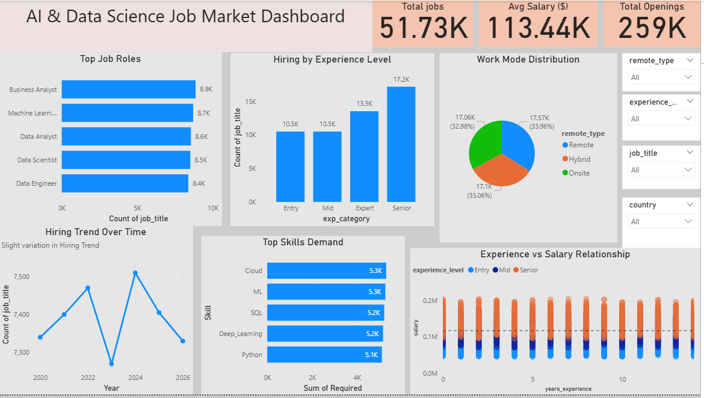

# 📊 AI & Data Science Job Market Trends & Salary Analysis

## 📌 Project Overview

This project focuses on analyzing the **AI and Data Science job market** to understand key trends in **salary, job demand, experience requirements, and skill demand**.

Using **Python for data analysis** and **Power BI for visualization**, this project provides meaningful insights to help job seekers, companies, and institutions make informed decisions.

## 🎯 Objectives

* Analyze job demand across various roles
* Understand salary distribution and influencing factors
* Study the impact of experience on salary
* Identify the most in-demand technical skills
* Analyze hiring trends over time

## 🗂 Dataset Description

The dataset includes the following features:

* Job Title
* Salary
* Years of Experience
* Experience Level (Entry, Mid, Senior, Expert)
* Job Openings
* Work Type (Remote, Hybrid, Onsite)
* Skills (Python, SQL, Machine Learning, Deep Learning, Cloud)
* Posting Date

## 🛠 Tools & Technologies Used

* **Python** (Pandas, NumPy, Matplotlib, Seaborn)
* **Power BI** (Dashboard & Visualization)
* **Google Colab** (Development Environment)

## 🧹 Data Preprocessing

The dataset was cleaned and prepared using Python:

* Handled missing values
* Converted columns to appropriate data types
* Created new features:

  * `total_skills` → total number of required skills
  * `is_remote` → indicator for remote jobs
* Removed inconsistencies and ensured data quality

## 📊 Exploratory Data Analysis (EDA)

Performed analysis to understand patterns and relationships:

* Salary distribution analysis
* Experience level distribution
* Work mode distribution
* Experience vs Salary relationship
* Hiring trends over time

## 📈 Power BI Dashboard

An interactive dashboard was created to visualize insights:

### 🔹 Visualizations Included:

* KPI Cards → Total Jobs, Average Salary, Total Openings
* Bar Chart → Top Job Roles
* Column Chart → Hiring by Experience Level
* Pie Chart → Work Mode Distribution
* Line Chart → Hiring Trend Over Time
* Bar Chart → Skills Demand
* Scatter Plot → Experience vs Salary

## 🔍 Key Insights

* Salary increases with experience (positive relationship)
* Skill demand is balanced across Python, SQL, ML, Deep Learning, and Cloud
* Hiring trends remain stable over time
* Work modes are evenly distributed (Remote, Hybrid, Onsite)
* Mid and Senior level roles dominate job demand

## 📊 Analysis Based on 4 Types

### 🔵 Descriptive Analysis

Summarizes current job market trends, salary distribution, and skill demand.

### 🟡 Diagnostic Analysis

Explains why companies prefer experienced and multi-skilled professionals.

### 🟢 Predictive Analysis

Indicates future growth in demand for AI and Data Science roles.

### 🔴 Prescriptive Analysis

Provides recommendations for job seekers, companies, and institutions.

## 💡 Business Recommendations

* Focus on multi-skill development (Python, SQL, ML, Cloud)
* Encourage continuous learning and upskilling
* Provide flexible work environments
* Use data-driven hiring strategies

## 🔄 Project Workflow

Data Collection → Data Cleaning (Python) → EDA → Dashboard (Power BI) → Insights → Report Generation

📷 Dashboard Preview

 

📄 Project Report

 [(pdf-link)](https://drive.google.com/file/d/1RnV72-BF2UyabU_7BUO4PmpvlkXloBo2/view?usp=sharing)

## 🚀 Future Enhancements

* Integrate real-time job market data
* Include additional features like company size and location
* Apply machine learning models for prediction
* Improve dashboard interactivity

## 🎯 Conclusion

The AI and Data Science job market is **stable, competitive, and skill-driven**.
Experience and multi-skill expertise play a crucial role in career growth, while organizations benefit from flexible and data-driven hiring practices.

